# Contrato de Dados: Camada 1 → Camada 2

<div align="center">

**Versão:** V0  
**Status:** ✅ Concluído, aguardando validação  
**Responsável:** Samuel Santos (Camada 1)  
**Consumidores diretos:** Camada 2 XAI / SHAP, Backend-hub

---

</div>

## 🎯 Objetivo deste documento

Este documento define o **contrato técnico mínimo, explícito e auditável** entre:

- **Camada 1 — Monitoramento de Campo**
- **Camada 2 — XAI / SHAP / Inteligência Artificial**

Ele responde de forma **inequívoca**:

- ✓ O que a Camada 1 **entrega como dado**
- ✓ **Quando** esses dados estão prontos para consumo
- ✓ **Em que formato** e com **quais garantias técnicas**
- ✓ O que **não é responsabilidade** da Camada 1 no MVP

> [!IMPORTANT]
> Este contrato existe para **eliminar ambiguidade**, **evitar dependências implícitas** e **destravar a Camada 2 com segurança**.

---

## 📥 Evento de Disparo (Trigger)

### 🧠 Trigger Lógico (Produto)

A Camada 2 **pode rodar apenas quando**:

- ☑️ O usuário **finaliza a sessão de monitoramento**
- ☑️ O usuário **edita uma sessão existente**
- ☑️ O usuário **insere uma nova sessão**

> [!NOTE]
> Nenhum outro evento é válido no V0.

---

### ⚙️ Trigger Técnico (Contrato)

Evidência objetiva no banco que confirma o disparo:

```sql
monitor_sessao.status = 'concluida'
```

<div align="center">

| **Evidência no Banco de Dados** | **Evidência na Interface** |
|:-------------------------------:|:--------------------------:|
| 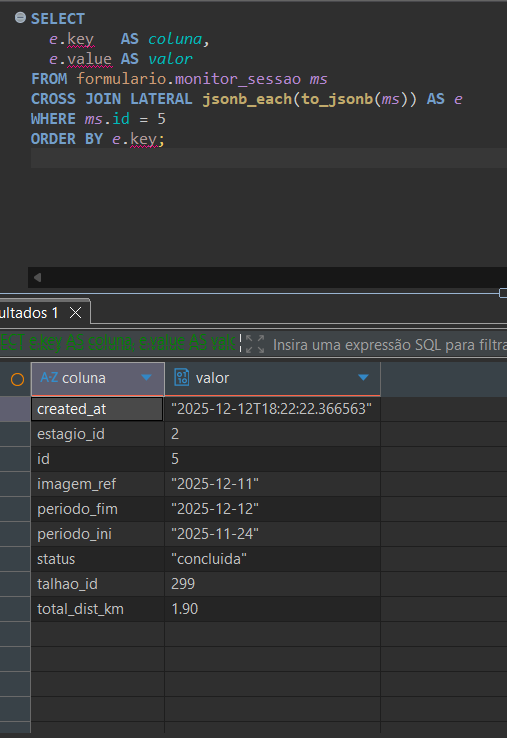 | 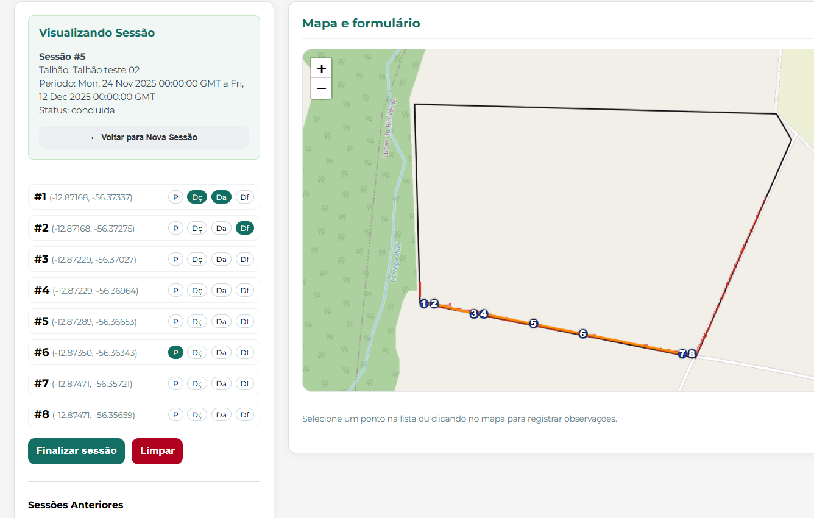 |

</div>

> [!WARNING]
> Sessões não finalizadas **não** disparam processamento.

📌 Não existem triggers alternativos no V0 (cron, timeout, upload, etc.).

---

## 🗺️ Estrutura de Dados Contratada

### 1️⃣ Geometria da Sessão

<table>
<tr>
<td><strong>Tipo</strong></td>
<td><code>geometry</code> (PostGIS)</td>
</tr>
<tr>
<td><strong>Subtipo esperado</strong></td>
<td><code>Polygon</code> ou <code>MultiPolygon</code></td>
</tr>
<tr>
<td><strong>SRID</strong></td>
<td><code>4326</code></td>
</tr>
<tr>
<td><strong>Origem da geometria</strong></td>
<td>Áreas definidas como zonas críticas com base no NDVI, para o período especificado, utilizando imagens Sentinel-2</td>
</tr>
</table>

#### 📊 Validação do SRID no Banco de Dados

Consulta realizada para validação:

```sql
SELECT
    f_table_schema      AS schema,
    f_table_name        AS tabela,
    f_geometry_column   AS coluna_geom,
    type                AS tipo_geometria,
    coord_dimension     AS dimensao,
    srid
FROM public.geometry_columns
WHERE f_table_name IN (
    'monitor_obs_daninha',
    'monitor_obs_deficiencia',
    'monitor_obs_doenca',
    'monitor_obs_praga',
    'monitor_ponto',
    'monitor_rota',
    'monitor_sessao',
    'monitor_zona',
    'diagnostico'
)
ORDER BY f_table_name;
```

**Resultado da consulta:**

| Schema | Tabela | Coluna Geom | Tipo Geometria | Dimensão | SRID |
|--------|--------|-------------|----------------|----------|------|
| formulario | diagnostico | geom | MULTIPOLYGON | 2 | **4326** |
| formulario | monitor_ponto | geom | POINT | 2 | **4326** |
| formulario | monitor_rota | geom | LINESTRING | 2 | **4326** |
| formulario | monitor_zona | geom | MULTIPOLYGON | 2 | **4326** |


<div align="center">

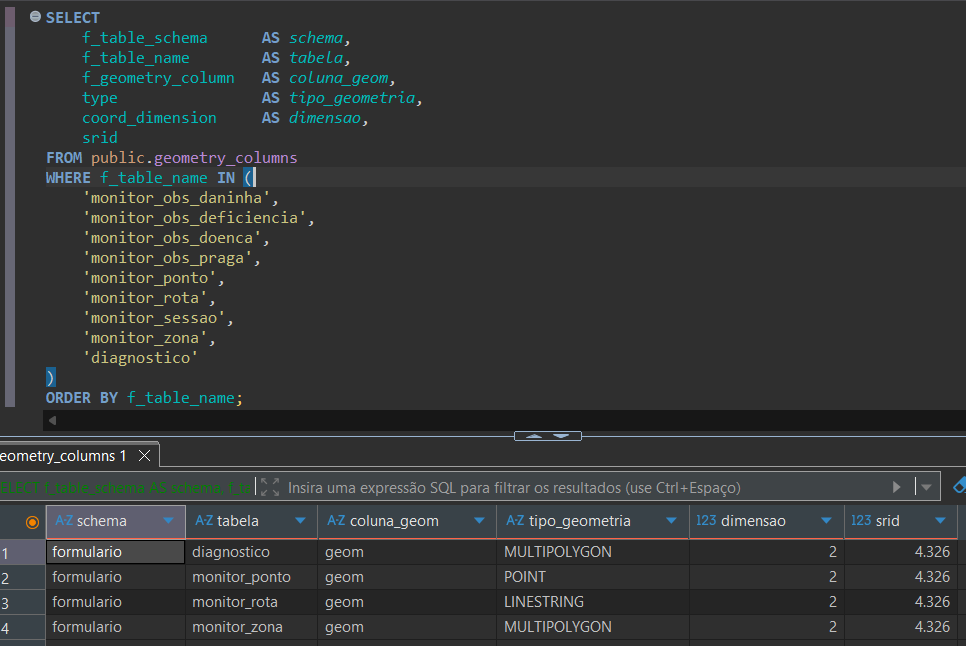

*Resultado da consulta SQL para validação do SRID*

</div>


#### 📍 Tabelas Utilizadas

As seguintes tabelas são utilizadas para compor a geometria da sessão:

- ☑️ `monitor_zona` — Zonas críticas detectadas
- ☑️ `monitor_rota` — Rotas percorridas durante o monitoramento
- ☑️ `monitor_ponto` — Pontos de observação em campo

---

### ✅ Garantias da Geometria

A Camada 1 garante que:

- ✓ `ST_IsValid(geometry) = true`
- ✓ Geometria sem buracos inválidos (a geometria é poligonizada a partir de pixels de imagem Sentinel-2; erros topológicos são raros e não impedem o funcionamento de sistemas Python que as coletam e tratam)
- ✓ Geometria representa apenas a área monitorada
- ✓ Geometria é recuperável para leitura e exportação

> [!IMPORTANT]
> A Camada 2 **assume esta geometria como verdade espacial**.

<div align="center">


*Exemplo de geometria de zona crítica renderizada no sistema*

</div>

<div align="center">

| **Evidência no Banco de Dados** | **Evidência na Interface** |
|:-------------------------------:|:--------------------------:|
| 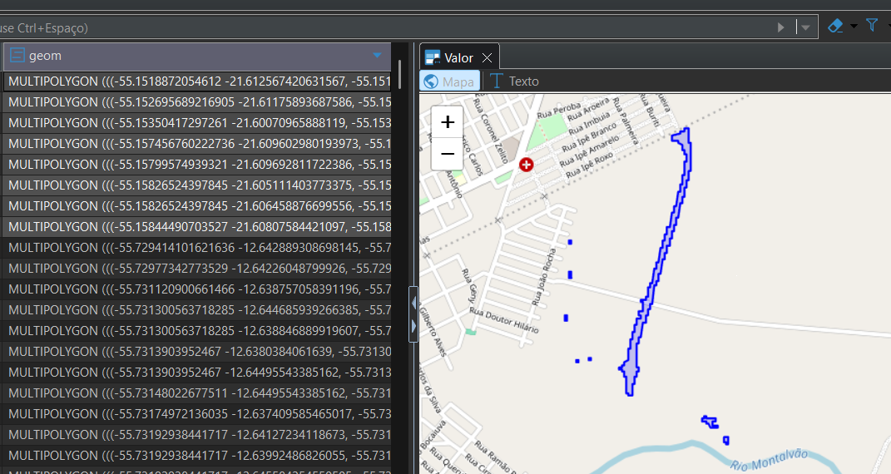 | 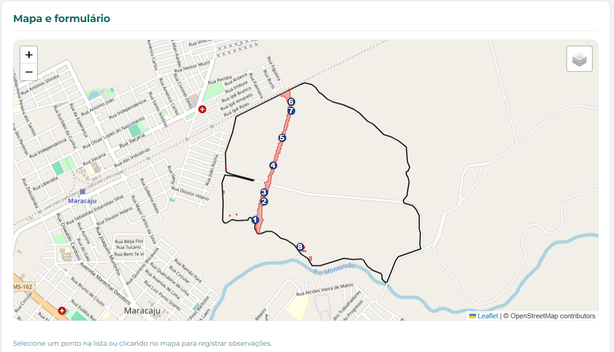 |

</div>

---

### 2️⃣ Observações de Campo

Cada observação possui:

| Campo | Tipo | Obrigatório | Observações |
|-------|------|:-----------:|-------------|
| `sessao_id` | int | ✅ | FK para `monitor_sessao` |
| `tipo` | enum | ✅ | `praga` \| `doença` \| `daninha` \| `deficiência` |
| `severidade` | enum | ✅ | `baixa` \| `moderada` \| `alta` |
| `timestamp` | timestamp | ✅ | Momento da observação |
| `nota` | text | ❌ | Texto livre |
| `foto` | text/path | ❌ | Evidência bruta |

> [!NOTE]
> **Fotos não são interpretadas no MVP.**  
> São armazenadas apenas como evidência, sem uso analítico.

---

### 🔢 Cardinalidade (Contrato Explícito)

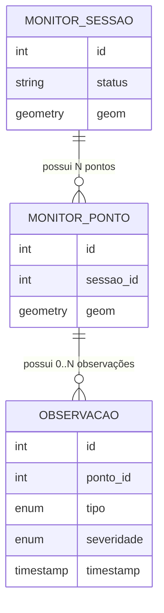

**Regras de cardinalidade:**

- Uma sessão possui **N pontos**  
  *A quantidade de pontos depende do tamanho da zona crítica detectada para o período analisado*

- Um ponto pode possuir **0..N observações**  
  *A quantidade de observações varia de acordo com as ocorrências reais observadas em campo, podendo ser uma ou mais por ponto*

- Cada observação pertence a **exatamente um ponto**  
  *Cada observação é vinculada a um ponto. Nem todos os pontos são obrigados a terem observações*

> [!IMPORTANT]
> Esta cardinalidade é **contrato conceitual e técnico** para a Camada 2.

---

## 🌱 Variáveis Ambientais

### Estado Atual (V0)

> [!WARNING]
> **NÃO fazem parte do contrato da Camada 1:**
> - NDVI
> - Chuva
> - Solo
> - Clima

📌 Estas variáveis **não são persistidas nem garantidas** pela Camada 1 no MVP.

> [!NOTE]
> A Camada 1 gera gráficos dessas variáveis para o relatório descritivo, mas o cálculo de estatísticas usadas no modelo (média, mediana, moda) é realizado diretamente na Camada 2 para maior eficiência, em vez de armazenar no banco.

👉 Elas podem ser **derivadas posteriormente pela Camada 2**, a partir da geometria, via serviços externos (ex.: Google Earth Engine).

---

## 📤 Formato de Entrega dos Dados

**Formato principal (V0):**

<div align="center">

```
┌─────────────────────────────────────┐
│   PostgreSQL / PostGIS Database     │
│                                     │
│   ├── monitor_sessao                │
│   ├── monitor_zona                  │
│   ├── monitor_ponto                 │
│   ├── monitor_rota                  │
│   └── observações*                  │
└─────────────────────────────────────┘
              ▲
              │
         SQL / SQLAlchemy
              │
         (Camada 2)
```

</div>

**Acesso:**

- ☑️ Leitura direta via SQL (geralmente via SQLAlchemy em Python)

**Views:**

- Opcionais
- **Não obrigatórias** no V0

> [!CAUTION]
> Payload via API / função **não faz parte deste contrato**.

---

## ✅ Garantias do Contrato

<div align="center">

| Garantia | Status |
|----------|:------:|
| Dados persistidos no banco | ✅ |
| Geometria válida e consistente | ✅ |
| Observações seguem contrato mínimo | ✅ |
| Histórico por sessão recuperável | ✅ |

</div>

> [!IMPORTANT]
> Toda inferência, transformação, cálculo ou decisão analítica é **responsabilidade exclusiva da Camada 2**.

---

## 🧭 Limites Explícitos do Contrato (V0)

<div style="background: linear-gradient(135deg, #667eea 0%, #764ba2 100%); padding: 20px; border-radius: 10px; color: white;">

### ⚠️ Este contrato **NÃO cobre**:

<table style="width: 100%; background: rgba(255,255,255,0.1); border-radius: 8px;">
<tr>
<td style="padding: 10px;">

❌ **Inferência agronômica**  
*Nessa camada temos apenas descrição. A inferência fica para a Camada 2*

❌ **Análise de imagem**  
*Cria mapas para o relatório, mas sem análise inferencial*

❌ **NDVI / clima / solo**  
*Cria mapas para o relatório*

</td>
<td style="padding: 10px;">

❌ **Scoring**  
*O banco possui catálogos de pesos e medidas para o modelo, a serem usados pela Camada 2*

❌ **Priorização**  
*Responsabilidade da Camada 2*

❌ **Explicabilidade (SHAP)**  
*Fica para a Camada 2*

❌ **Relatórios ou PDFs**  
*A Camada 1 gera um relatório inicial com mapas e gráficos descritivos*

</td>
</tr>
</table>

</div>

> [!IMPORTANT]
> Qualquer item acima pertence à Camada 2 ou camadas superiores, conforme explicado.

---

## 🏗️ Nota de Arquitetura

Este contrato:

- ✓ É versionado (V0, V1, V2…)
- ✓ Não muda sem alinhamento explícito entre camadas
- ✓ Protege o produto de deriva técnica e escopo implícito
- ✓ É **pré-requisito obrigatório** para integração da Camada 2

---

## ✅ Checklist de Evidências Obrigatórias (Aceite do Contrato)

> [!NOTE]
> Este checklist deve ser marcado pelo responsável da Camada 1.  
> Somente após todos os itens estarem comprovados, o contrato pode ser considerado **aceito**.

### 🔍 Evidências Técnicas

- [X] Existe evidência no banco de `monitor_sessao.status = 'concluida'` (Evidencia A)
- [X] A geometria associada à sessão é válida (`ST_IsValid = true`) (Evidencia B)
- [X] A geometria está no SRID 4326 (Evidencia B)
- [X] As observações possuem FK válida para ponto e sessão (Evidencia C)
- [X] Campos obrigatórios são garantidos:
	[X] tipo: garantido via UX (formulário só abre após seleção de categoria)
	[X] severidade: campo required no HTML + validação backend (Evidencia D)
	[X] timestamp: gerado automaticamente com now() 
- [X] Cardinalidade ponto ↔ observação respeitada no banco (Evidencia E (csv e print)
- [X] Sessão pode ser recuperada integralmente após finalização (Evidencia F/G)
- [X] Exportação/consulta da geometria funciona (SQL / GeoJSON / SHP) (Evidencia H/I)

#### 📸 Galeria de Evidências

<div align="center">

| Evidência A | Evidência B | Evidência C | Evidência D |
|-------------|-------------|-------------|-------------|
| <a href="static/demo/evid_a.png" target="_blank"></a> | <a href="static/demo/evid_b.png" target="_blank">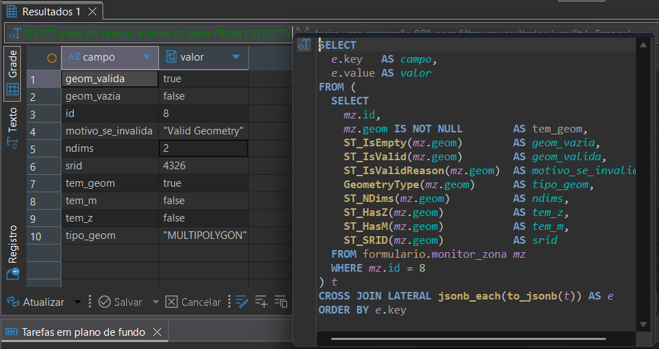</a> | <a href="static/demo/evid_c.png" target="_blank">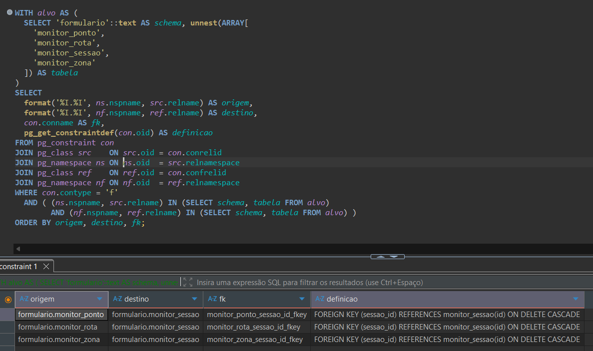</a> | <a href="static/demo/evid_d.png" target="_blank">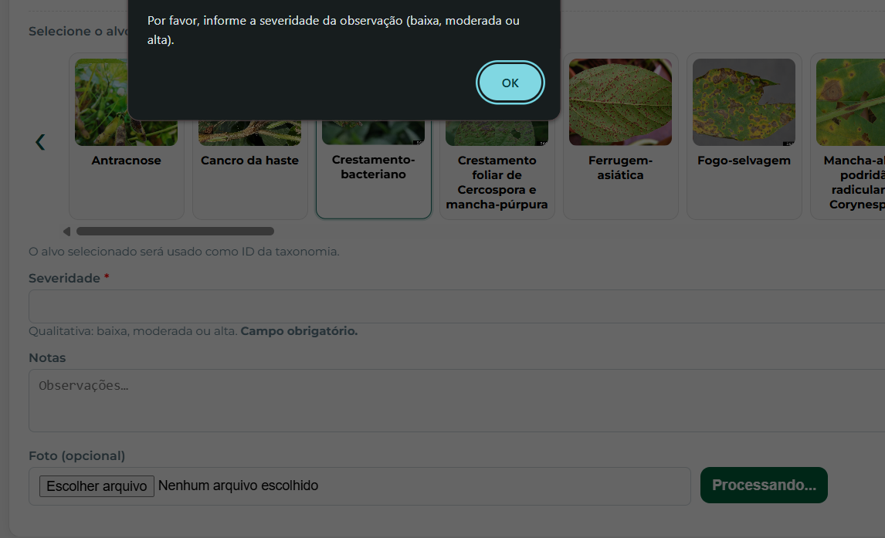</a> |

| Evidência E (CSV) | Evidência E (Print) | Evidência F | Evidência G |
|-------------------|---------------------|-------------|-------------|
| <a href="static/demo/evid_e.csv" target="_blank">Evidência E (CSV)</a> | <a href="static/demo/evid_e.png" target="_blank">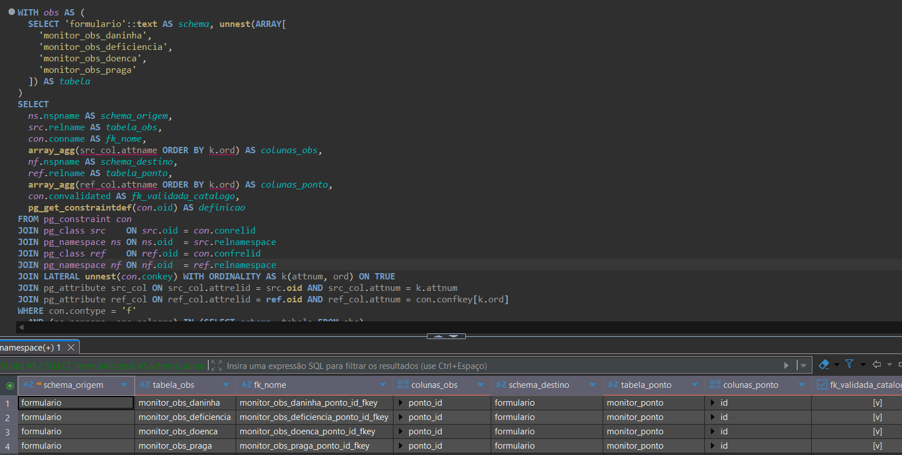</a> | <a href="static/demo/evid_f.png" target="_blank">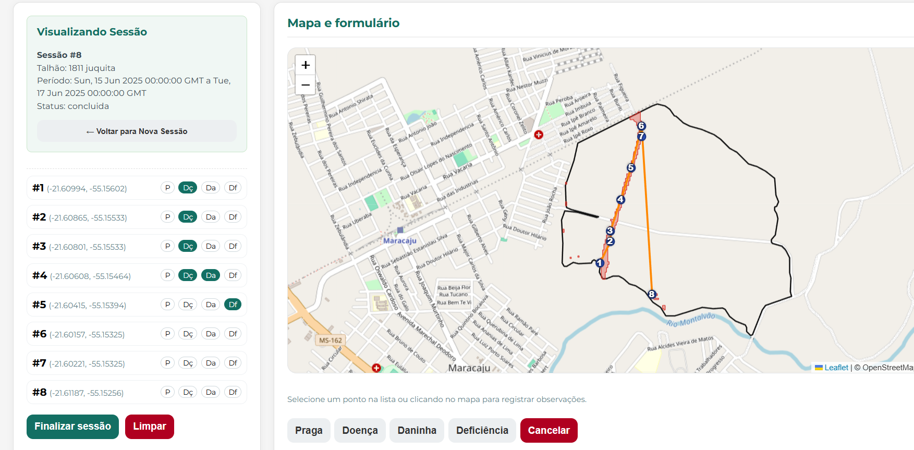</a> | <a href="static/demo/evid_g.png" target="_blank">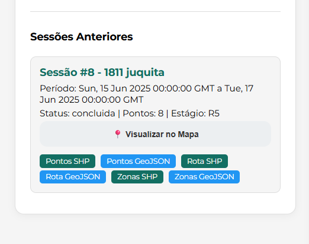</a> |

| Evidência H | Evidência I |
|-------------|-------------|
| <a href="static/demo/evid_h.png" target="_blank">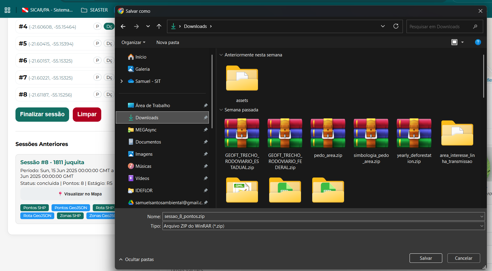</a> | <a href="static/demo/evid_i.png" target="_blank">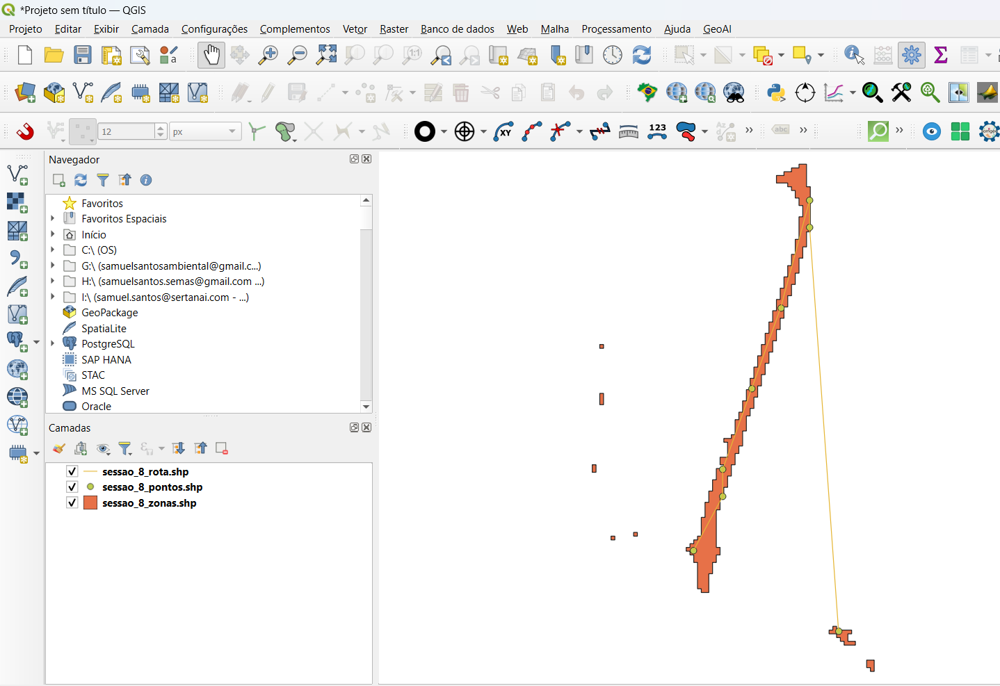</a> |

</div>

<div align="center">

### 🌐 Esquema do geral do banco de dados

**Acesse a documentação completa e demonstrações:**  
🔗 [https://sertan-ai.github.io/documentacao-ss-camada1](https://sertan-ai.github.io/documentacao-ss-camada1)

</div>

---

### 🔒 Limites Confirmados

- [X] NDVI não é persistido pela Camada 1
- [X] Precipitação não é persistida pela Camada 1
- [X] Fotos não são interpretadas no MVP
- [X] Nenhuma inferência ocorre antes do trigger oficial
- [X] O design final do relatório ainda não está definido; o design atual é uma prova de conceito

---

## 📌 Status Final

<div align="center" style="background: linear-gradient(135deg, #f093fb 0%, #f5576c 100%); padding: 30px; border-radius: 15px; margin: 20px 0;">

### 📋 Contrato de Dados (V0)

**Status:** ⏳ **Aguardando aceite**

**Responsável pela validação:** Samuel Santos (Camada 1)  
**Consumidores dependentes:** Silvio / Nilo / Camada 2

---

<table style="width: 100%; background: rgba(255,255,255,0.2); border-radius: 10px; margin-top: 20px;">
<tr>
<td align="center" style="padding: 15px;">
<strong>Data de criação:</strong><br>
Dezembro 2025
</td>
<td align="center" style="padding: 15px;">
<strong>Última atualização:</strong><br>
V0 - 2025
</td>
<td align="center" style="padding: 15px;">
<strong>Próxima revisão:</strong><br>
Após aceite da Camada 2
</td>
</tr>
</table>

</div>

---

<div align="center">

*Documento técnico • Sertan AI • Camada 1 — Monitoramento de Campo*

[](https://github.com/Sertan-AI/documentacao-ss-camada1)

</div>
