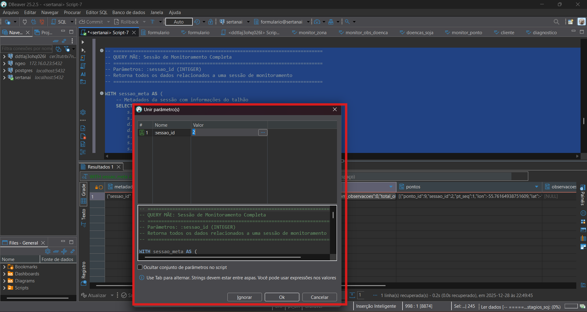
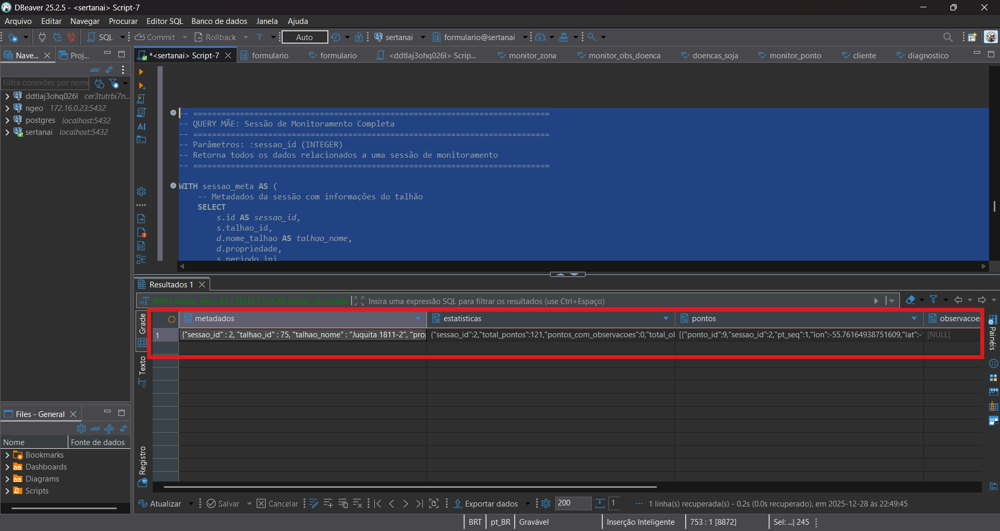

# 📋 Documentação — Camada 1 (V0)

> **Sistema de Monitoramento de Campo**  
> Sertan AI • Camada 1 → Camada 2

---

## 📑 Índice

- [🎯 Visão](#-visão)
- [📜 Contratos](#-contratos)
- [⚙️ Artefatos Executáveis](#️-artefatos-executáveis)
- [📸 Evidências](#-evidências)
- [✅ Checklist de Aceite (V0)](#-checklist-de-aceite-v0)

---

## 🎯 Visão

Este repositório contém a **documentação técnica completa** da Camada 1 do sistema de monitoramento de campo da Sertan AI.

**Objetivo**: Estabelecer um **contrato técnico inequívoco** entre a Camada 1 (Monitoramento de Campo) e a Camada 2 (XAI/SHAP), definindo:

- ✅ Quais dados são entregues
- ✅ Quando os dados estão prontos para consumo
- ✅ Em que formato e com quais garantias técnicas
- ✅ O que **não** é responsabilidade da Camada 1

**Versão**: V0 (MVP)  
**Status**: ✅ Concluído, aguardando aceite da Camada 2

---

## 📜 Contratos

### Contrato Principal

**[Contrato de Dados: Camada 1 → Camada 2](contrato_de_dados.md)**  
Documento central que define todos os aspectos técnicos do contrato entre camadas.

### Contratos Específicos

| Contrato | Descrição | Link |
|----------|-----------|------|
| **Campo `talhao_id` (V0)** | Contrato semântico do identificador de talhão | [docs_talhao_id.md](docs_talhao_id.md) |
| **Contrato do Tempo (V0)** | Timestamps (UTC), `observed_at` vs `created_at` | [contrato_de_dados.md#-contrato-do-tempo-v0](contrato_de_dados.md#-contrato-do-tempo-v0) |
| **Loop MVP** | Fluxo operacional mínimo do produto | [loop_monitor.md](loop_monitor.md) |

### Documentação Auxiliar

| Documento | Descrição | Link |
|-----------|-----------|------|
| **Modelo de Dados** | ERD, tabelas, relacionamentos, Query Mãe | [docs_monitoramento_relacionamento.md](docs_monitoramento_relacionamento.md) |

---

## ⚙️ Artefatos Executáveis

### Query Mãe (Golden Query)

**Arquivo**: [query_sessao_completa_v0.sql](query_sessao_completa_v0.sql)

**Descrição**: Query SQL completa que recupera **todos os dados de uma sessão de monitoramento** em uma única execução (metadados, pontos, observações, rota, zonas).

**Retorno**: 1 linha JSON estruturada.

> **⚠️ IMPORTANTE**: Esta query requer:
> - **PostgreSQL/PostGIS** conectado
> - **DBeaver** ou cliente SQL compatível
> - Substituir `:sessao_id` por um ID existente no banco
> 
> **Não é um executável standalone** - requer ambiente configurado.

**Evidências de execução**:

| Execução no DBeaver | Resultado da Query |
|:-------------------:|:------------------:|
|  |  |
| *Interface do DBeaver executando a query* | *Dados retornados em formato JSON* |

---

## 📸 Evidências

### Galeria de Evidências

Todas as evidências técnicas estão organizadas em:

📂 **[static/demo/](static/demo/)**

As evidências estão **contextualizadas** nos documentos onde são relevantes:

- **[Contrato de Dados](contrato_de_dados.md)**: Contém galeria completa de evidências (A-I) com prints do banco, interface, exports, etc.
- **[Loop Monitor](loop_monitor.md)**: Evidências de rastreabilidade completa de observações
- **[Query Mãe](static/demo/)**: Evidências de execução e resultados da Golden Query

### Lista de Evidências Disponíveis

| Evidência | Tipo | Onde está documentada |
|-----------|------|-----------------------|
| Trigger (`status = 'concluida'`) | Banco + Interface | [contrato_de_dados.md](contrato_de_dados.md#%EF%B8%8F-trigger-técnico-contrato) |
| Geometrias válidas (SRID 4326) | Banco | [contrato_de_dados.md](contrato_de_dados.md#-validação-do-srid-no-banco-de-dados) |
| Observações com FK válida | Banco | [contrato_de_dados.md](contrato_de_dados.md#-checklist-de-evidências-obrigatórias-aceite-do-contrato) |
| Severidade obrigatória | Backend + Frontend | [contrato_de_dados.md](contrato_de_dados.md#-checklist-de-evidências-obrigatórias-aceite-do-contrato) |
| Cardinalidade ponto↔observação | CSV + Print | [contrato_de_dados.md](contrato_de_dados.md#-galeria-de-evidências) |
| Recuperação de sessão | Interface | [contrato_de_dados.md](contrato_de_dados.md#-galeria-de-evidências) |
| Export GeoJSON/SHP | Arquivos | [contrato_de_dados.md](contrato_de_dados.md#-galeria-de-evidências) |
| Rastreabilidade completa | SQL + Print | [loop_monitor.md](loop_monitor.md#-rastreio-completo-obs-doença--doença--ponto--sessão) |
| Golden Query (execução) | DBeaver | [static/demo/golden_query_execucao.png](static/demo/golden_query_execucao.png) |
| Golden Query (resultado) | DBeaver | [static/demo/golden_query_resultado.png](static/demo/golden_query_resultado.png) |

---

## ✅ Checklist de Aceite (V0)

### Contratos Formais

- [x] **0.1 Contrato `talhao_id` existe**  
  → [docs_talhao_id.md](docs_talhao_id.md) — Semântica, garantias e breaking changes

- [x] **0.2 Contrato do Tempo existe**  
  → [contrato_de_dados.md (linhas 292-328)](contrato_de_dados.md#L292-L328) — Timestamps UTC, `observed_at` vs `created_at`, ordenação temporal

- [x] **0.3 Golden Query existe**  
  → [query_sessao_completa_v0.sql](query_sessao_completa_v0.sql) — Query Mãe executável (requer DBeaver + PostgreSQL)

### Evidências Técnicas

- [x] **Evidências anexadas**  
  → [static/demo/](static/demo/) — Galeria completa documentada no [Contrato de Dados](contrato_de_dados.md#-galeria-de-evidências)

### Critérios Operacionais

- [x] **Critérios operacionais validados**  
  → [contrato_de_dados.md](contrato_de_dados.md#-checklist-de-evidências-obrigatórias-aceite-do-contrato)
  
  Incluindo:
  - ✅ Trigger: `monitor_sessao.status = 'concluida'`
  - ✅ Geometrias: SRID 4326, `ST_IsValid = true`
  - ✅ Timestamps: UTC, servidor-side, ordenação não regressiva
  - ✅ Severidade: obrigatória, validada frontend + backend
  - ✅ Cardinalidade: respeitada e evidenciada
  - ✅ NDVI: processo upstream não persistido (claramente documentado)
  - ✅ Unicidade de sessão: declarada como soft rule (sem constraint)

---

## 🎯 Critério de Pronto

✅ **Este checklist pode ser "carimbado" com um print para validação do V0.**

Todos os itens estão **verificados, documentados e evidenciados**.

---

## 📌 Informações de Versionamento

| Item | Valor |
|------|-------|
| **Versão** | V0 (MVP) |
| **Data de criação** | Dezembro 2025 |
| **Última atualização** | 28-12-2025 |
| **Responsável** | Samuel Santos (Camada 1) |
| **Consumidores** | Camada 2 (XAI/SHAP), Backend-hub |
| **Status** | ⏳ Aguardando aceite da Camada 2 |

---

## 🔗 Links Rápidos

- 🌐 **Documentação Interativa**: [https://sertan-ai.github.io/documentacao-ss-camada1](https://sertan-ai.github.io/documentacao-ss-camada1)
- 📄 **Contrato de Dados**: [contrato_de_dados.md](contrato_de_dados.md)
- 🔄 **Loop MVP**: [loop_monitor.md](loop_monitor.md)
- 🗺️ **Modelo de Dados**: [docs_monitoramento_relacionamento.md](docs_monitoramento_relacionamento.md)
- 📊 **Query Mãe**: [query_sessao_completa_v0.sql](query_sessao_completa_v0.sql)

---

*Documento técnico • Sertan AI • Camada 1 — Monitoramento de Campo*

