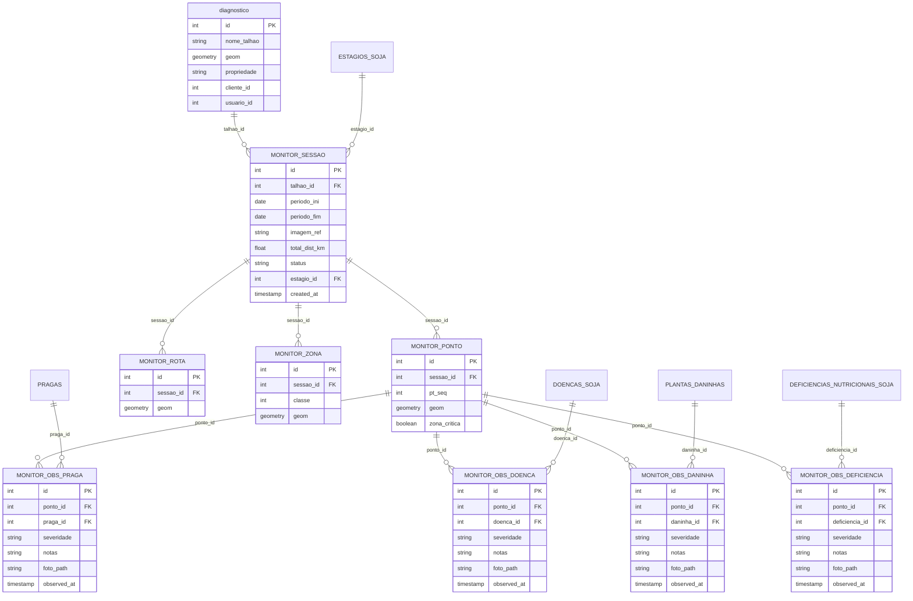

# Sistema de Monitoramento - Modelo de Dados e Relacionamentos

## 📋 Visão Geral

O sistema de **monitoramento de campo** permite criar sessões de coleta de dados em talhões agrícolas, com pontos amostrais para registro de observações sobre pragas, doenças, plantas daninhas e deficiências nutricionais.

---

## 🗺️ Diagrama de Relacionamento (ERD)



> **💡 Documentação Completa sobre `talhao_id`**: 
> 
> Para detalhes completos sobre o campo `talhao_id`, incluindo tipo de dados, relacionamentos, fluxos de dados e exemplos práticos, consulte o **documento oficial**:
> 
> 📄 **[Documentação: Campo `talhao_id`](docs_talhao_id.md)** ← Fonte única e oficial

---

## 📊 Estrutura de uma Sessão de Monitoramento Completa

### Hierarquia de Dados

```
📦 SESSÃO DE MONITORAMENTO
│
├── 📄 Metadados da Sessão (monitor_sessao)
│   ├── Talhão (referência a diagnostico)
│   ├── Período de coleta
│   ├── Estágio fenológico
│   └── Status (aberta/concluida)
│
├── 🗺️ Dados Espaciais
│   ├── Rota de coleta (monitor_rota)
│   └── Zonas críticas (monitor_zona)
│
├── 📍 Pontos Amostrais (monitor_ponto)
│   └── Para cada ponto:
│       ├── 🐛 Observações de Pragas (monitor_obs_praga)
│       ├── 🦠 Observações de Doenças (monitor_obs_doenca)
│       ├── 🌿 Observações de Daninhas (monitor_obs_daninha)
│       └── 🍃 Observações de Deficiências (monitor_obs_deficiencia)
```

---

## 📋 Descrição das Tabelas

### 1. `monitor_sessao` - Sessão de Monitoramento (Tabela Central)

Representa uma campanha de monitoramento em um talhão específico durante um período.

| Coluna | Tipo | Descrição |
|--------|------|-----------|
| `id` | SERIAL | Identificador único da sessão |
| `talhao_id` | INTEGER | FK para `diagnostico.id` (talhão monitorado) |
| `periodo_ini` | DATE | Data de início do período de monitoramento |
| `periodo_fim` | DATE | Data de fim do período de monitoramento |
| `imagem_ref` | VARCHAR | Referência da imagem satélite usada (ex: "2024-01-10") |
| `total_dist_km` | NUMERIC | Distância total da rota em km |
| `status` | VARCHAR | Status da sessão: `aberta` ou `concluida` |
| `estagio_id` | INTEGER | FK para estágio fenológico da cultura |
| `created_at` | TIMESTAMP | Data/hora de criação da sessão |

**Regra de Negócio (Soft Rule - Aplicação)**: A aplicação tenta evitar sessões duplicadas por combinação de `(talhao_id, periodo_ini, periodo_fim)`. 

> **⚠️ Não há constraint UNIQUE no banco**: Esta é uma regra implementada na camada de aplicação, não uma garantia técnica do banco de dados.

---

### 2. `monitor_ponto` - Pontos Amostrais

Pontos de coleta de dados gerados automaticamente dentro do talhão.

| Coluna | Tipo | Descrição |
|--------|------|-----------|
| `id` | SERIAL | Identificador único do ponto |
| `sessao_id` | INTEGER | FK para `monitor_sessao.id` |
| `pt_seq` | INTEGER | Sequência do ponto na rota (1, 2, 3...) |
| `geom` | GEOMETRY(Point, 4326) | Coordenada geográfica (lat/lon) |
| `zona_critica` | BOOLEAN | Se o ponto está em zona crítica (determinada por processo upstream NDVI*) |

*NDVI não persistido, usado apenas durante geração

**Quantidade Típica**: 12 pontos por sessão (gerados automaticamente).

---

### 3. `monitor_rota` - Rota de Coleta

LineString conectando os pontos na ordem ideal de visitação.

| Coluna | Tipo | Descrição |
|--------|------|-----------|
| `id` | SERIAL | Identificador único da rota |
| `sessao_id` | INTEGER | FK para `monitor_sessao.id` |
| `geom` | GEOMETRY(LineString, 4326) | Geometria da rota |

**Cardinalidade**: 1 rota por sessão.

---

### 4. `monitor_zona` - Zonas Críticas

Áreas problemáticas identificadas por análise de imagens de satélite.

| Coluna | Tipo | Descrição |
|--------|------|-----------|
| `id` | SERIAL | Identificador único da zona |
| `sessao_id` | INTEGER | FK para `monitor_sessao.id` |
| `classe` | INTEGER | Classe de criticidade (0=crítica, 1=média, 2=boa) |
| `geom` | GEOMETRY(MultiPolygon, 4326) | Geometria da zona |

**Fonte**: Geradas via Google Earth Engine. **NDVI do Sentinel-2 é usado como processo upstream** (não persistido) para identificar classes de criticidade.

> **⚠️ IMPORTANTE**: NDVI não é armazenado no banco. Apenas as geometrias resultantes são persistidas.

---

### 5-8. Tabelas de Observações

Cada ponto pode ter múltiplas observações de diferentes categorias.

#### `monitor_obs_praga` - Observações de Pragas

| Coluna | Tipo | Descrição |
|--------|------|-----------|
| `id` | SERIAL | Identificador único |
| `ponto_id` | INTEGER | FK para `monitor_ponto.id` |
| `praga_id` | INTEGER | FK para `pragas.id` |
| `severidade` | VARCHAR | `baixa`, `moderada` ou `alta` |
| `notas` | TEXT | Observações adicionais |
| `foto_path` | VARCHAR | Caminho da foto (se houver) |
| `observed_at` | TIMESTAMP | Data/hora da observação |

#### `monitor_obs_doenca` - Observações de Doenças

Estrutura idêntica, referenciando `doencas_soja.id`.

#### `monitor_obs_daninha` - Observações de Plantas Daninhas

Estrutura idêntica, referenciando `plantas_daninhas.id`.

#### `monitor_obs_deficiencia` - Observações de Deficiências Nutricionais

Estrutura idêntica, referenciando `deficiencias_nutricionais_soja.id`.

---

## 🔍 Query SQL Mãe - Sessão Completa

### 📄 Arquivo SQL Oficial

A **Query Mãe completa** está disponível no arquivo:

**[query_sessao_completa_v0.sql](query_sessao_completa_v0.sql)** ← Fonte única oficial (V0)

> **🔒 CONTRATO (V0)**  
> Este arquivo SQL é a **única fonte oficial** da Query Mãe.  
> Atualizações devem ser feitas no arquivo `.sql`, não duplicadas em documentação.

### Estrutura da Query

A query utiliza **CTEs (Common Table Expressions)** para organizar os dados:

```sql
-- Estrutura geral da Query Mãe
WITH 
    sessao_meta AS (...)           -- Metadados da sessão + talhão
    sessao_pontos AS (...)         -- Pontos com contagem de observações
    sessao_observacoes AS (...)    -- Todas as observações (UNION de 4 tabelas)
    sessao_rota AS (...)           -- Geometria da rota
    sessao_zonas AS (...)          -- Zonas críticas
    estatisticas_gerais AS (...)   -- Estatísticas agregadas

SELECT 
    json_build_object(...) AS metadados,
    row_to_json(eg.*) AS estatisticas,
    (SELECT json_agg(...) FROM sessao_pontos) AS pontos,
    (SELECT json_agg(...) FROM sessao_observacoes) AS observacoes,
    (SELECT row_to_json(...) FROM sessao_rota) AS rota,
    (SELECT json_agg(...) FROM sessao_zonas) AS zonas
FROM sessao_meta sm
CROSS JOIN estatisticas_gerais eg;
```

---

## 📝 Exemplo de Uso da Query Mãe

### Consultar Sessão #456

```sql
-- Substituir :sessao_id por 456
-- Todas as CTEs da query mãe usam este parâmetro

SELECT * FROM (
    -- [QUERY MÃE COMPLETA AQUI]
    -- Onde :sessao_id = 456
) resultado;
```

### Resultado Esperado

A query retorna **1 linha** com todas as informações em formato JSON:

```json
{
  "metadados": {
    "sessao_id": 456,
    "talhao_id": 123,
    "talhao_nome": "Talhão Sul A",
    "propriedade": "Fazenda Santa Maria",
    "periodo_ini": "2024-01-01",
    "periodo_fim": "2024-01-15",
    "imagem_ref": "2024-01-10",
    "total_dist_km": 2.5,
    "status": "concluida",
    "estagio_id": 2,
    "estagio_nome": "V4",
    "created_at": "2024-01-01T08:00:00"
  },
  "estatisticas": {
    "total_pontos": 12,
    "pontos_com_observacoes": 8,
    "total_obs_pragas": 5,
    "total_obs_doencas": 3,
    "total_obs_daninhas": 2,
    "total_obs_deficiencias": 1,
    "total_observacoes_geral": 11,
    "obs_severidade_alta": 2,
    "obs_severidade_moderada": 6,
    "obs_severidade_baixa": 3
  },
  "pontos": [...],
  "observacoes": [...],
  "rota": {...},
  "zonas": [...]
}
```

---

## 🎯 Casos de Uso

### Caso 1: Criar uma Sessão Completa

```python
# 1. Criar sessão
INSERT INTO formulario.monitor_sessao 
    (talhao_id, periodo_ini, periodo_fim, status, estagio_id)
VALUES (123, '2024-01-01', '2024-01-15', 'aberta', 2)
RETURNING id;  -- Retorna 456

# 2. Inserir pontos (12x)
INSERT INTO formulario.monitor_ponto (sessao_id, pt_seq, geom)
VALUES (456, 1, ST_GeomFromText('POINT(-47.123 -15.456)', 4326));
-- ... repetir para os 12 pontos

# 3. Inserir rota
INSERT INTO formulario.monitor_rota (sessao_id, geom)
VALUES (456, ST_GeomFromText('LINESTRING(...)', 4326));

# 4. Usuário coleta dados no campo e salva observações
INSERT INTO formulario.monitor_obs_praga (ponto_id, praga_id, severidade, notas)
VALUES (1001, 5, 'moderada', 'Lagarta presente em 30% das plantas');
```

### Caso 2: Consultar Progresso de uma Sessão

```sql
SELECT 
    COUNT(*) AS total_pontos,
    SUM(CASE WHEN tem_observacoes THEN 1 ELSE 0 END) AS pontos_preenchidos,
    ROUND(
        SUM(CASE WHEN tem_observacoes THEN 1 ELSE 0 END) * 100.0 / COUNT(*), 
        2
    ) AS percentual_completo
FROM (
    SELECT 
        p.id,
        EXISTS (
            SELECT 1 FROM formulario.monitor_obs_praga WHERE ponto_id = p.id
            UNION ALL
            SELECT 1 FROM formulario.monitor_obs_doenca WHERE ponto_id = p.id
            UNION ALL
            SELECT 1 FROM formulario.monitor_obs_daninha WHERE ponto_id = p.id
            UNION ALL
            SELECT 1 FROM formulario.monitor_obs_deficiencia WHERE ponto_id = p.id
        ) AS tem_observacoes
    FROM formulario.monitor_ponto p
    WHERE p.sessao_id = 456
) pontos_status;
```

### Caso 3: Concluir Sessão

```sql
UPDATE formulario.monitor_sessao 
SET status = 'concluida' 
WHERE id = 456;
```

---

## 📌 Regras de Negócio Importantes

### Soft Rules (Aplicação - sem constraint no banco)

1. **Unicidade de Sessão**: A aplicação evita criar duas sessões com mesmo `(talhao_id, periodo_ini, periodo_fim)` em status `aberta`
   
   > **⚠️ Atenção**: Não há constraint UNIQUE no banco. Esta é uma regra de negócio implementada na aplicação, não uma garantia técnica enforcível pelo banco de dados.

### Garantias Técnicas (Banco de Dados)

2. **Severidade Obrigatória**: Todas as observações DEVEM ter severidade (`baixa`, `moderada` ou `alta`)

3. **Cascata de Deleção**: Ao deletar uma sessão, todos os pontos, rota, zonas e observações são deletados automaticamente

4. **Pontos Sequenciais**: Os pontos devem ter `pt_seq` de 1 a N sem pulos

5. **Geometrias válidas**: Todas as geometrias devem estar em SRID 4326 (WGS84)

---

## 🔐 Controle de Acesso

Sessões pertencem ao usuário/cliente que criou o diagnóstico do talhão:

```sql
-- Verificar permissão de acesso
SELECT s.* 
FROM formulario.monitor_sessao s
JOIN diagnostico d ON d.id = s.talhao_id
WHERE s.id = :sessao_id
  AND (d.cliente_id = :cliente_id OR d.usuario_id = :usuario_id);
```

---

**Última atualização**: 28-12-2025