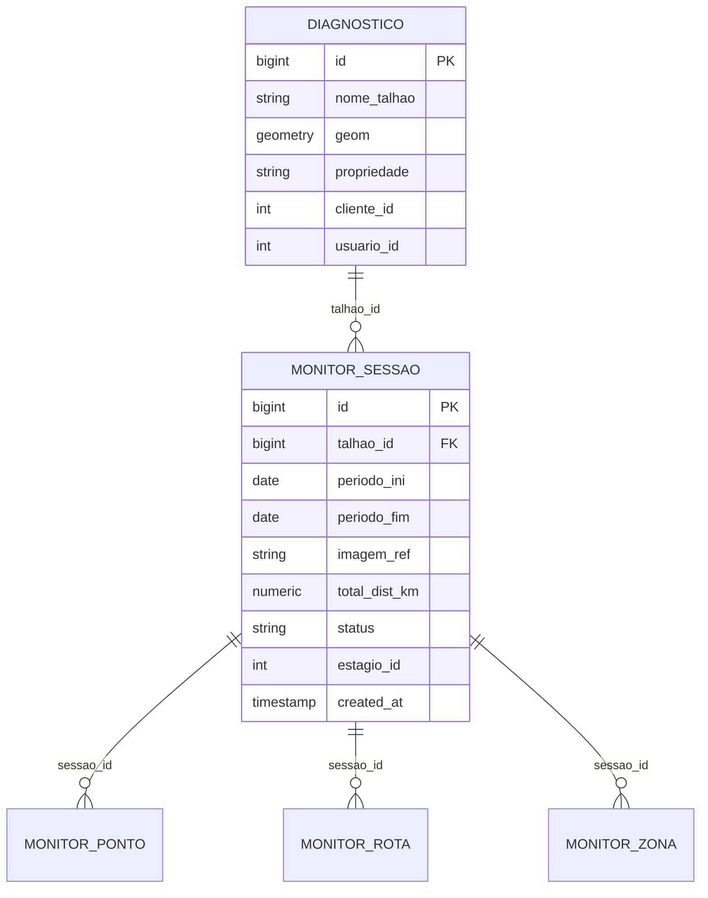
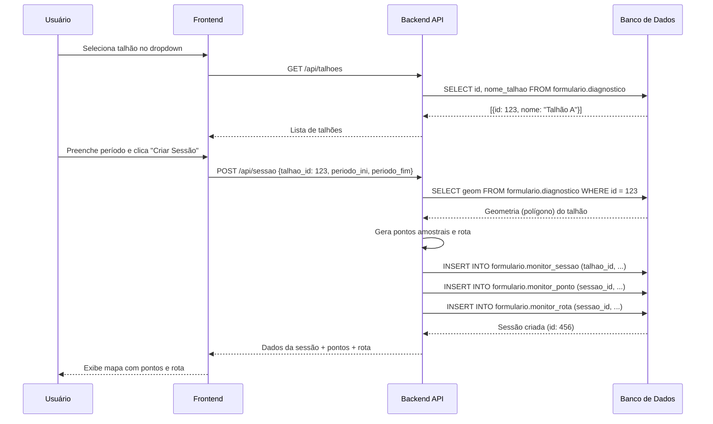
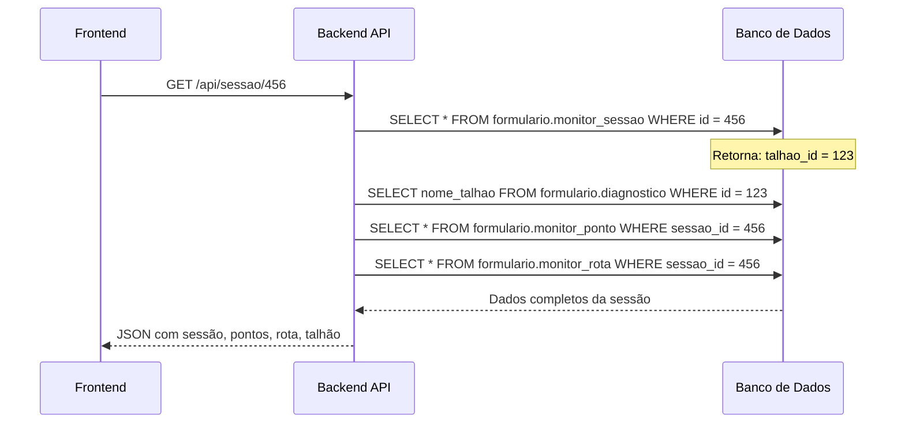

# Documentação: Campo `talhao_id`

## 📋 Índice

- [O que é `talhao_id`?](#o-que-é-talhao_id)
- [Relação com Outras Tabelas](#relação-com-outras-tabelas)
- [Onde é Usado](#onde-é-usado)
- [Fluxo de Dados](#fluxo-de-dados)
- [Estratégia de Fallback](#estratégia-de-fallback)
- [Exemplos Práticos](#exemplos-práticos)

---

## O que é `talhao_id`?

**`talhao_id`** é o identificador único (chave estrangeira) que vincula uma **sessão de monitoramento** a um **talhão** específico.

### Contexto Agrícola

Um **talhão** é uma parcela ou lote de terra cultivável dentro de uma propriedade rural. Representa uma área específica delimitada geograficamente onde é plantada uma cultura (geralmente soja, neste sistema).

### Tipo de Dado

- **Tipo**: `BIGINT` (int8)
- **Obrigatório**: ✅ Sim (NOT NULL)
- **Chave Estrangeira**: Referencia `formulario.diagnostico.id`

---

## Relação com Outras Tabelas

### Diagrama de Relacionamento



### Relacionamento Principal

```sql
formulario.monitor_sessao.talhao_id → formulario.diagnostico.id
```

> **💡 Nota Importante**: O `talhao_id` referencia **diretamente** `formulario.diagnostico.id`. Cada registro na tabela `diagnostico` representa um talhão com sua geometria espacial (polígono) e metadados associados.

---

## Onde é Usado

### 1. **Tabela `monitor_sessao`**

Coluna que armazena o ID do talhão sendo monitorado:

```sql
CREATE TABLE formulario.monitor_sessao (
    id BIGSERIAL PRIMARY KEY,
    talhao_id BIGINT NOT NULL,        -- ← Campo principal: FK para diagnostico.id
    periodo_ini DATE NOT NULL,
    periodo_fim DATE NOT NULL,
    imagem_ref TEXT,
    total_dist_km NUMERIC(8, 2),
    status TEXT NOT NULL DEFAULT 'aberta',
    estagio_id INTEGER,
    created_at TIMESTAMP NOT NULL DEFAULT NOW()
);
```

### 2. **API: Listagem de Talhões** (`GET /api/talhoes`)

Endpoint que retorna os talhões disponíveis para o usuário:

**Arquivo**: [app/monitoramento/routes.py:493-544](https://github.com/Sertan-AI/sertanai-app/blob/main/app/monitoramento/routes.py#L493-L544)

```python
@bp.get("/api/talhoes")
@require_login
def listar_talhoes():
    # Busca da tabela diagnostico
    t_diag = diagnosticos_table()  # Retorna "formulario.diagnostico"
    
    base_sql = f"""
        SELECT DISTINCT ON (nome_talhao)
               id AS diag_id,           -- ← Este ID será o talhao_id
               nome_talhao AS nome
          FROM {t_diag}
         WHERE nome_talhao IS NOT NULL AND nome_talhao <> ''
         ORDER BY nome_talhao, id DESC
    """
    
    return jsonify([{"id": r["diag_id"], "nome": r["nome"]} for r in rows])
```

**Retorno JSON**:
```json
[
    {"id": 123, "nome": "Talhão A"},
    {"id": 124, "nome": "Talhão B"}
]
```

### 3. **API: Criar Sessão** (`POST /api/sessao`)

Endpoint que cria uma nova sessão de monitoramento:

**Arquivo**: [app/monitoramento/routes.py:666-838](https://github.com/Sertan-AI/sertanai-app/blob/main/app/monitoramento/routes.py#L666-L838)

```python
@bp.post("/api/sessao")
@require_login
def criar_sessao():
    data = request.get_json(silent=True) or {}
    talhao_id = data.get("talhao_id")      # ← Obrigatório
    periodo_ini = data.get("periodo_ini")
    periodo_fim = data.get("periodo_fim")
    estagio_id = data.get("estagio_id")
    
    # Validação
    if not (talhao_id and periodo_ini and periodo_fim):
        return jsonify({
            "ok": False, 
            "error": "missing_fields",
            "detail": "Campos obrigatórios: talhao_id, periodo_ini, periodo_fim"
        }), 400
    
    # Inserção na tabela
    conn.execute(text(f"""
        INSERT INTO {mon_table("monitor_sessao")}
        (talhao_id, periodo_ini, periodo_fim, imagem_ref, total_dist_km, status, estagio_id)
        VALUES (:tid, :pi, :pf, :img, :dist, 'aberta', :eid)
        RETURNING id
    """), {
        "tid": talhao_id,  # ← Usado aqui
        "pi": periodo_ini,
        "pf": periodo_fim,
        # ...
    })
```

**Payload de Exemplo**:
```json
{
    "talhao_id": 123,
    "periodo_ini": "2024-01-01",
    "periodo_fim": "2024-01-15",
    "estagio_id": 2
}
```

### 4. **API: Listar Sessões** (`GET /api/sessoes`)

Filtro opcional por `talhao_id`:

**Arquivo**: [app/monitoramento/routes.py:1320-1358](https://github.com/Sertan-AI/sertanai-app/blob/main/app/monitoramento/routes.py#L1320-L1358)

```python
@bp.get("/api/sessoes")
@require_login
def listar_sessoes():
    talhao_id = request.args.get("talhao_id", type=int)  # ← Filtro opcional
    
    if talhao_id is not None:
        filtros.append("s.talhao_id = :tid")
        params["tid"] = talhao_id
```

**Exemplo de Chamada**:
```
GET /api/sessoes?talhao_id=123
```

### 5. **Interface Frontend** (JavaScript)

**Arquivo**: [app/templates/monitoramento/index.html:756-769](https://github.com/Sertan-AI/sertanai-app/blob/main/app/templates/monitoramento/index.html#L756-L769)

```javascript
// Captura o ID do talhão selecionado no formulário
const talhao_id = parseInt(el("selTalhao").value);
const estagio_id = parseInt(el("selEstagio").value);
const periodo_ini = el("inpPeriodoIni").value;
const periodo_fim = el("inpPeriodoFim").value;

// Validação
if (!talhao_id || !estagio_id || !periodo_ini || !periodo_fim) {
    alert("Preencha todos os campos");
    return;
}

// Envia para criar sessão
fetch("/api/sessao", {
    method: "POST",
    headers: { "Content-Type": "application/json" },
    body: JSON.stringify({ talhao_id, estagio_id, periodo_ini, periodo_fim })
});
```

### 6. **Exibição de Informações da Sessão**

**Arquivo**: [app/templates/monitoramento/index.html:792](https://github.com/Sertan-AI/sertanai-app/blob/main/app/templates/monitoramento/index.html#L792)

```javascript
// Exibe informações da sessão ativa
el("sessaoInfo").textContent = 
    `Sessão #${s.id} • Talhão ${s.talhao_id} • ${s.periodo_ini} a ${s.periodo_fim} • ${s.status}`;
```

---

## Fluxo de Dados

### Criação de uma Sessão de Monitoramento



### Consulta de Sessão Existente



---

## Busca de Dados do Talhão

O sistema busca informações do talhão diretamente da tabela `diagnostico`:

```python
# Código real de app/monitoramento/routes.py
diag_tbl = diagnosticos_table()  # Retorna "formulario.diagnostico"

talhao = conn.execute(text(f"""
    SELECT id, ST_AsText(geom) AS wkt, nome_talhao AS nome
      FROM {diag_tbl}
     WHERE id = :tid
"""), {"tid": talhao_id}).mappings().first()

if not talhao or not talhao.get("wkt"):
    return jsonify({
        "ok": False, 
        "error": "not_found",
        "detail": "Geometria não encontrada para talhão/diagnóstico."
    }), 404
```

### Query para Metadados da Sessão

```sql
SELECT 
    s.id, 
    s.talhao_id, 
    s.periodo_ini, 
    s.periodo_fim,
    d.nome_talhao AS talhao_nome,
    d.propriedade
FROM formulario.monitor_sessao s
LEFT JOIN formulario.diagnostico d ON d.id = s.talhao_id
WHERE s.id = :sessao_id
```

---

## Exemplos Práticos

### Exemplo 1: Criar Sessão via API

**Request**:
```bash
curl -X POST http://localhost:5000/api/sessao \
  -H "Content-Type: application/json" \
  -d '{
    "talhao_id": 123,
    "periodo_ini": "2024-01-01",
    "periodo_fim": "2024-01-15",
    "estagio_id": 2
  }'
```

**Response**:
```json
{
  "sessao": {
    "id": 456,
    "talhao_id": 123,
    "talhao_nome": "Talhão A - Soja",
    "periodo_ini": "2024-01-01",
    "periodo_fim": "2024-01-15",
    "imagem_ref": "2024-01-10",
    "total_dist_km": 2.5,
    "status": "aberta",
    "estagio_id": 2
  },
  "pontos": [
    {"id": 1, "pt_seq": 1, "lon": -47.123, "lat": -15.456, "status": {}},
    {"id": 2, "pt_seq": 2, "lon": -47.124, "lat": -15.457, "status": {}}
  ],
  "rota": {
    "type": "LineString",
    "coordinates": [[-47.123, -15.456], [-47.124, -15.457]]
  }
}
```

### Exemplo 2: Listar Sessões de um Talhão Específico

**Request**:
```bash
curl http://localhost:5000/api/sessoes?talhao_id=123
```

**Response**:
```json
[
  {
    "id": 456,
    "talhao_id": 123,
    "talhao_nome": "Talhão A - Soja",
    "periodo_ini": "2024-01-01",
    "periodo_fim": "2024-01-15",
    "status": "concluida",
    "total_obs": 15
  },
  {
    "id": 789,
    "talhao_id": 123,
    "talhao_nome": "Talhão A - Soja",
    "periodo_ini": "2024-02-01",
    "periodo_fim": "2024-02-15",
    "status": "aberta",
    "total_obs": 3
  }
]
```

### Exemplo 3: Query SQL Completa

Buscar todas as sessões com informações do talhão:

```sql
SELECT 
    s.id AS sessao_id,
    s.talhao_id,
    d.nome_talhao AS talhao_nome,
    d.propriedade,
    s.periodo_ini,
    s.periodo_fim,
    s.status,
    s.total_dist_km,
    COUNT(DISTINCT p.id) AS total_pontos,
    COUNT(DISTINCT op.id) + COUNT(DISTINCT od.id) + 
    COUNT(DISTINCT oda.id) + COUNT(DISTINCT odf.id) AS total_observacoes
FROM formulario.monitor_sessao s
LEFT JOIN formulario.diagnostico d ON d.id = s.talhao_id
LEFT JOIN formulario.monitor_ponto p ON p.sessao_id = s.id
LEFT JOIN formulario.monitor_obs_praga op ON op.ponto_id = p.id
LEFT JOIN formulario.monitor_obs_doenca od ON od.ponto_id = p.id
LEFT JOIN formulario.monitor_obs_daninha oda ON oda.ponto_id = p.id
LEFT JOIN formulario.monitor_obs_deficiencia odf ON odf.ponto_id = p.id
WHERE s.status = 'aberta'
GROUP BY s.id, s.talhao_id, d.nome_talhao, d.propriedade
ORDER BY s.created_at DESC;
```

---

## Considerações Importantes

### ⚠️ Pontos de Atenção

1. O `talhao_id` referencia **`formulario.diagnostico.id`** - não existe tabela `talhoes` separada
2. A geometria do talhão **deve existir** e ser válida para gerar pontos/rota de monitoramento
3. Tipo de dado é `BIGINT` (int8), não `INTEGER`
4. Todas as tabelas de monitoramento estão no schema `formulario`

### 🔐 Segurança

> **⚠️ ATENÇÃO**: A listagem de talhões (`GET /api/talhoes`) aplica filtros por `cliente_id` e `usuario_id`, mas a **criação de sessão** (`POST /api/sessao`) **não valida** se o usuário tem permissão para acessar o `talhao_id` informado. Isso representa uma potencial vulnerabilidade de segurança.

---

## Referências de Código

| Local | Arquivo | Linhas |
|-------|---------|--------|
| Listar Talhões | [app/monitoramento/routes.py](https://github.com/Sertan-AI/sertanai-app/blob/main/app/monitoramento/routes.py#L493-L544) | 493-544 |
| Criar Sessão | [app/monitoramento/routes.py](https://github.com/Sertan-AI/sertanai-app/blob/main/app/monitoramento/routes.py#L666-L838) | 666-838 |
| Buscar Geometria | [app/monitoramento/routes.py](https://github.com/Sertan-AI/sertanai-app/blob/main/app/monitoramento/routes.py#L698-L730) | 698-730 |
| Payload Sessão | [app/monitoramento/routes.py](https://github.com/Sertan-AI/sertanai-app/blob/main/app/monitoramento/routes.py#L849-L927) | 849-927 |
| Frontend - Criar | [app/templates/monitoramento/index.html](https://github.com/Sertan-AI/sertanai-app/blob/main/app/templates/monitoramento/index.html#L756-L769) | 756-769 |
| Frontend - Listar | [app/templates/monitoramento/index.html](https://github.com/Sertan-AI/sertanai-app/blob/main/app/templates/monitoramento/index.html#L1180) | 1180 |

---

**Última atualização**: 2024-12-25
