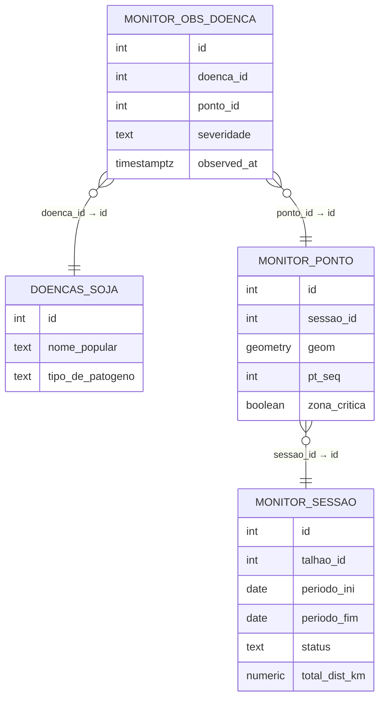
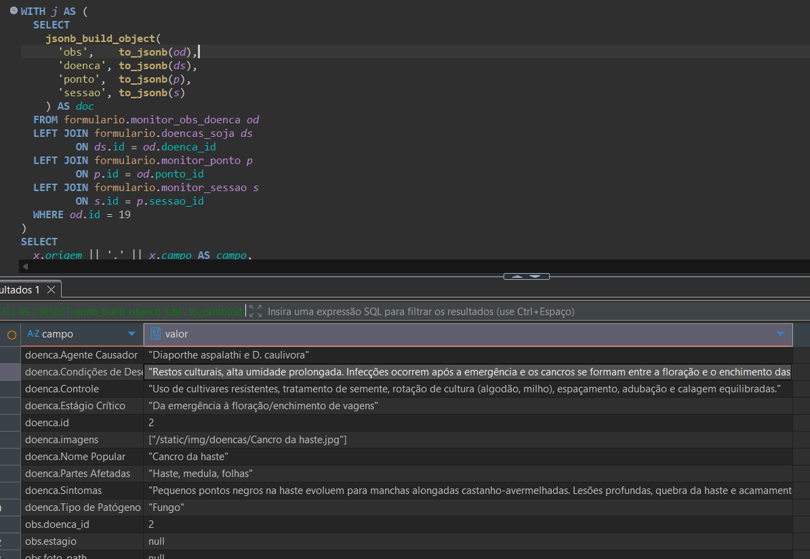

# 📄 Loop MVP — Monitoramento de Campo (Camada 1)

**Versão:**

[🔒 LOOP MÍNIMO DO MVP — SERTANAI V0](https://www.notion.so/LOOP-M-NIMO-DO-MVP-SERTANAI-V0-2ceb777f46dc801d8601c251372b4336?pvs=21)

V0

**Status:**

Em validação

**Responsável:**

Samuel Santos

**Consumidores diretos:**

Camada 2 (XAI / SHAP), Backend-hub

⸻

## 🎯 Objetivo desta página

Esta página define o **loop mínimo funcional, técnico e contratual** do MVP da SertanAI na **Camada 1 — Monitoramento de Campo**.

Ela existe para responder, de forma **binária, testável e sem ambiguidade**:

- qual é o **fluxo mínimo que caracteriza o MVP**;
- quando uma sessão está **oficialmente encerrada**;
- o que é **garantia técnica da Camada 1**;
- o que **outras camadas podem assumir como verdade**;
- e o que **explicitamente NÃO faz parte do MVP**.

👉 Se este loop não roda exatamente como descrito aqui, **o MVP não existe**.

---

## 🔁 Loop MVP — Visão Geral (V0)

Fluxo mínimo **contratual** do produto:

1. Cadastrar o imóvel/talhão e adicionar uma geometria
2. Criar sessão de monitoramento apontando o período a ser analisado
3. Uma geometria de zona crítica é criada com base em índices de NDVI / pontos são distribuídos nessas zonas
3. Registrar observações de campo (por ponto, podendo ser uma ou mais em cada ponto. não necessariamente todos os pontos devem ser adicionados de anotações)
4. Finalizar uma sessão = **trigger único** (não tem timeout, periodicidade ou algo assim)
5. Persistir dados no banco (geometria, observações e dados gerais são armazenados no banco de dados para posterior uso no modelo)
6. Recuperar / exportar a sessão posteriormente (visualizar sessões anteriores, baixar zonas, pontos e rotas em geojson e shp (shp, shx, dbf e prj zipados)

📌 **Nenhum passo adicional é obrigatório no V0.** ✔️

📌 Qualquer variação fora disso é hipótese futura. ✔️

---

## ⚙️ Trigger Oficial do Loop

### 🧠 Trigger Lógico (Produto)

- ☑️ Sessão finalizada explicitamente pelo usuário ✔️

### ⚙️ Trigger Técnico (Contrato)

- ☑️ `monitor_sessao.status = 'concluida'` ✔️

📌 **Este é o único evento que fecha o loop no V0.**

📌 Sessões não finalizadas **não** geram consumo pela Camada 2. ✔️

---

## 🧩 Etapas Detalhadas do Loop

### 1️⃣ Criação de Sessão

- Usuário entra em monitoramento
- Usuário filtra as propriedades vinculadas ao seu cadastro de cliente
- Usuário filtra talhões vinculados a propriedade selecionada
- Usuário cria uma nova seção selecionando o período a ser analisado 
- Sistema gera um `sessao_id`
- Sistema gera geometrias de zonas criticas (calculado pelo ndvi no período) e vincula à sessao_id
- Sistema lança pontos distribuídos pelas zonas críticas.

**Status:** ✅ Implementado ✔️

**Garantia:** `sessao_id` persistido no banco ✔️

---

### 2️⃣ Geometria da Sessão (Fonte Espacial)

- Cada sessão possui **uma geometria associada** ‼️(Não necessariamente, pois pode haver mais de uma geometria, no entanto elas são unidas pelo sessao_id)
- A geometria representa **exclusivamente a área monitorada** ✔️
- A geometria é armazenada no PostGIS ✔️

**Parâmetros contratuais:**

- Tipo: `geometry` ✔️
- Subtipo: `Polygon` ou `MultiPolygon` ✔️
- SRID: `4326` ✔️
- Validação: `ST_IsValid(geometry) = true` ✔️

**Tabelas possíveis (conforme schema atual):** ✔️

- `monitor_zona` ✔️
- `monitor_rota` ✔️
- `monitor_ponto` ✔️

📌 A Camada 2 **assume esta geometria como verdade espacial**.

**Status:** ✅ Implementado ✔️

---

### 3️⃣ Observações de Campo

Cada observação registrada contém, no mínimo:

- `sessao_id`
- `tipo` (praga | doença | daninha | deficiência)
- `severidade` (baixa | moderada | alta)
- `timestamp` (tudo ok)

Campos opcionais:

- nota livre
- foto (evidência bruta) (tudo ok)

### Cardinalidade (Contrato Explícito)

- Uma sessão possui **N pontos**
- Um ponto pode possuir **0..N observações**
- Cada observação pertence a **exatamente um ponto**

📌 Esta cardinalidade é **contrato conceitual e técnico**. (tá tudo ok)

**Status:** ✅ Implementado ✔️

---

### 4️⃣ Finalização da Sessão (Fechamento do Loop)

- Sessão é marcada como `concluida`
- Nenhuma nova observação é aceita após isso (o sistema atual permite edição de sessões. podemos bloquear)
- Este evento **fecha definitivamente o loop do MVP** (mais de uma seção pode ser feita na mesma área. note que o objetivo é monitorar a área durente todo o processo da germinação à colheita)

**Status:** ✅ Implementado ✔️

📌 Nenhum outro evento encerra uma sessão no V0. ✔️

---

### 5️⃣ Persistência dos Dados

- Sessão, geometria e observações são gravadas no Postgres ✔️
- Os dados permanecem íntegros após finalização ✔️

**Garantias verificáveis:**

- dados persistidos no banco ✔️
- observações com FK válida ✔️
- sessão recuperável por `sessao_id` ✔️

## 🔎 Rastreio completo (Obs. Doença → Doença → Ponto → Sessão)

A consulta abaixo recupera, **em uma única execução**, o encadeamento completo a partir de um registro em `formulario.monitor_obs_doenca` (ex.: `id = 19`), trazendo:

- **Observação** (`monitor_obs_doenca`)
- **Cadastro da Doença** (`doencas_soja`, incluindo "Nome Popular")
- **Ponto de monitoramento** (`monitor_ponto`, incluindo geometria)
- **Sessão** (`monitor_sessao`, via `ponto.sessao_id`)

### ✅ Consulta única (retorno transposto)

```sql
WITH j AS (
  SELECT
    jsonb_build_object(
      'obs',    to_jsonb(od),
      'doenca', to_jsonb(ds),
      'ponto',  to_jsonb(p),
      'sessao', to_jsonb(s)
    ) AS doc
  FROM formulario.monitor_obs_doenca od
  LEFT JOIN formulario.doencas_soja ds
         ON ds.id = od.doenca_id
  LEFT JOIN formulario.monitor_ponto p
         ON p.id = od.ponto_id
  LEFT JOIN formulario.monitor_sessao s
         ON s.id = p.sessao_id
  WHERE od.id = 19
)
SELECT
  x.origem || '.' || x.campo AS campo,
  x.valor                    AS valor
FROM j
CROSS JOIN LATERAL (
  SELECT 'doenca' AS origem, e.key AS campo, e.value AS valor FROM jsonb_each(j.doc->'doenca') e
  UNION ALL
  SELECT 'obs'    AS origem, e.key AS campo, e.value AS valor FROM jsonb_each(j.doc->'obs')    e
  UNION ALL
  SELECT 'ponto'  AS origem, e.key AS campo, e.value AS valor FROM jsonb_each(j.doc->'ponto')  e
  UNION ALL
  SELECT 'sessao' AS origem, e.key AS campo, e.value AS valor FROM jsonb_each(j.doc->'sessao') e
) AS x
ORDER BY campo;
```

### 📌 Exemplo de resultado (id = 19)

| campo                               | valor                                                                                                                                                                                                                        |
| ----------------------------------- | ---------------------------------------------------------------------------------------------------------------------------------------------------------------------------------------------------------------------------- |
| doenca.Agente Causador              | `"Diaporthe aspalathi e D. caulivora"`                                                                                                                                                                                       |
| doenca.Condições de Desenvolvimento | `"Restos culturais, alta umidade prolongada. Infecções ocorrem após a emergência e os cancros se formam entre a floração e o enchimento das vagens."`                                                                        |
| doenca.Controle                     | `"Uso de cultivares resistentes, tratamento de semente, rotação de cultura (algodão, milho), espaçamento, adubação e calagem equilibradas."`                                                                                 |
| doenca.Estágio Crítico              | `"Da emergência à floração/enchimento de vagens"`                                                                                                                                                                            |
| doenca.Nome Popular                 | `"Cancro da haste"`                                                                                                                                                                                                          |
| doenca.Partes Afetadas              | `"Haste, medula, folhas"`                                                                                                                                                                                                    |
| doenca.Sintomas                     | `"Pequenos pontos negros na haste evoluem para manchas alongadas castanho-avermelhadas. Lesões profundas, quebra da haste e acamamento. Medula necrosada. Folha 'carijó' (necrose entre nervuras) no caso de D. aspalathi."` |
| doenca.Tipo de Patógeno             | `"Fungo"`                                                                                                                                                                                                                    |
| doenca.id                           | `2`                                                                                                                                                                                                                          |
| doenca.imagens                      | `["/static/img/doencas/Cancro da haste.jpg"]`                                                                                                                                                                                |
| obs.doenca_id                       | `2`                                                                                                                                                                                                                          |
| obs.estagio                         | `null`                                                                                                                                                                                                                       |
| obs.foto_path                       | `null`                                                                                                                                                                                                                       |
| obs.id                              | `19`                                                                                                                                                                                                                         |
| obs.notas                           | `""`                                                                                                                                                                                                                         |
| obs.observed_at                     | `"2025-12-23T03:50:56.324047"`                                                                                                                                                                                               |
| obs.ponto_id                        | `231`                                                                                                                                                                                                                        |
| obs.severidade                      | `"baixa"`                                                                                                                                                                                                                    |
| ponto.geom                          | `{"crs":{"type":"name","properties":{"name":"EPSG:4326"}},"type":"Point","coordinates":[-55.154636511756934,-21.606077349455948]}`                                                                                           |
| ponto.id                            | `231`                                                                                                                                                                                                                        |
| ponto.notas                         | `null`                                                                                                                                                                                                                       |
| ponto.pt_seq                        | `4`                                                                                                                                                                                                                          |
| ponto.sessao_id                     | `8`                                                                                                                                                                                                                          |
| ponto.zona_critica                  | `false`                                                                                                                                                                                                                      |
| sessao.created_at                   | `"2025-12-06T18:33:34.632687"`                                                                                                                                                                                               |
| sessao.estagio_id                   | `5`                                                                                                                                                                                                                          |
| sessao.id                           | `8`                                                                                                                                                                                                                          |
| sessao.imagem_ref                   | `"2025-06-16"`                                                                                                                                                                                                               |
| sessao.periodo_fim                  | `"2025-06-17"`                                                                                                                                                                                                               |
| sessao.periodo_ini                  | `"2025-06-15"`                                                                                                                                                                                                               |
| sessao.status                       | `"concluida"`                                                                                                                                                                                                                |
| sessao.talhao_id                    | `74`                                                                                                                                                                                                                         |
| sessao.total_dist_km                | `2.29`                                                                                                                                                                                                                       |

---

### 🧭 Diagrama das ligações (Mermaid)



<div align="center">



*Print da consulta SQL executada no banco de dados, confirmando a rastreabilidade completa.*

</div>

**Status:** ✅ Implementado ✔️

---

### 6️⃣ Recuperação / Histórico

Após finalização, o sistema permite:

- listar sessões anteriores ✔️
- recuperar geometria da sessão ✔️
- consultar observações associadas ✔️
- exportar dados (GeoJSON / CSV / SHP, conforme disponível) ✔️

**Status:** ✅ Implementado ✔️

---

## 📦 Outputs Garantidos do Loop

Ao final do loop, a Camada 1 **garante**:

- `sessao_id` identificável ✔️
- geometria válida da área monitorada ✔️
- conjunto estruturado de observações ✔️
- dados persistidos e recuperáveis ✔️
- histórico consultável por sessão ✔️

👉 Estes outputs são o **único insumo confiável** entregue à Camada 2. ✔️

---

## 🔌 Relação com a Camada 2 (XAI)

A Camada 2 pode assumir como verdade que:

- o trigger é único (`sessao.status = 'concluida'`); ✔️
- a geometria é válida e consistente; ✔️
- as observações seguem contrato mínimo; ✔️
- os dados estão persistidos e recuperáveis. ✔️

⚠️ **Nada fora disso é garantido.** ✔️

---

## 🚫 Itens Explicitamente Fora do Loop (V0)

Este loop **NÃO inclui**:

- NDVI
- chuva
- solo
- clima
- inferência agronômica
- análise de imagem
- interpretação de fotos
- scoring
- SHAP
- relatórios
- dashboards
- múltiplos triggers
- escalabilidade cloud

👉 Tudo isso pertence à **Camada 2 ou superior**. ✔️✔️

---

## 📌 Status Geral do Loop

- Loop MVP: ✅ funcional ✔️
- Trigger binário: ✅ ✔️
- Persistência: ✅ ✔️
- Geometria válida: ✅ ✔️
- Simetria com contrato de dados: ✅
- Pronto para consumo pela Camada 2: ⬜ **Aguardando aceite** ✔️

*Observação: por mim ok*

---

## 🧠 Nota de Governança de Produto

Esta página é o **espelho operacional** do contrato de dados.

Qualquer mudança:

- deve ser registrada aqui **e** no contrato,
- deve indicar impacto em Camada 2,
- deve manter clareza binária (entra / não entra).

<div align="center">

**Acesse a documentação completa do banco e demonstrações:**  
🔗 [https://sertan-ai.github.io/documentacao-ss-camada1](https://sertan-ai.github.io/documentacao-ss-camada1)

**Acesse o Contrato de Dados:** [README.MD](README.MD)

</div>

<div align="center">

*Documento técnico • Sertan AI • Camada 1 — Monitoramento de Campo*

[](https://github.com/Sertan-AI/documentacao-ss-camada1)

</div>